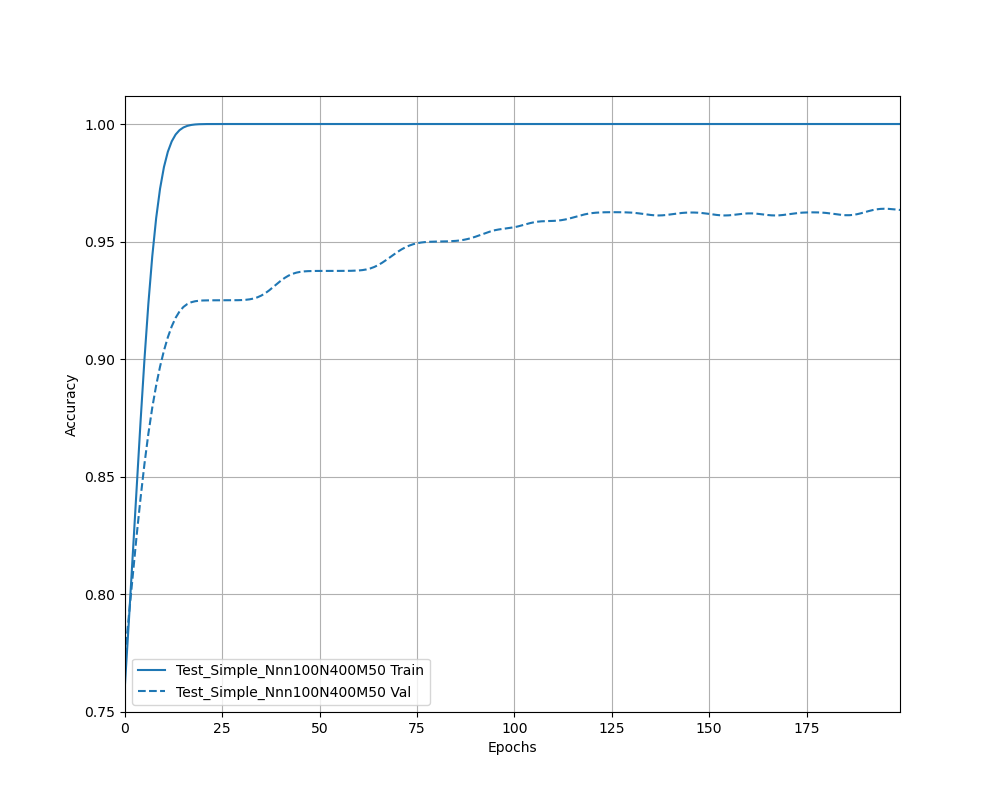

# AutoCPD -- Automatic Change-Point Detection in Time Series via Deep Learning

`AutoCPD` is a Python package for detecting the multiple change-points and change-types using deep neural networks.

## Installation

Install via pip with

```bash
python3 -m pip install autocpd
```

**Note**: This package requires [tensorflow>=2.7](https://www.tensorflow.org/install) and [tensorflow-docs](https://github.com/tensorflow/docs), please install these two libraries in your virtual environment. For other requirements on the Python libraries, see [AutoCPD]().

## Basic Usage

Please refer to the online [documentations](https://autocpd.readthedocs.io/en/latest/) for each module in `AutoCPD`. The two important functions to construct shallow and deep neural network are `general_simple_nn()` and `general_deep_nn()` respectively. For `general_simple_nn()`, one can specify the number of layers, the width vector and the number of classes, see more details [here](https://autocpd.readthedocs.io/en/latest/autocpd.html#autocpd.neuralnetwork.simple_nn). For the function `general_deep_nn()`, one can specify the number of transformations, kernel size, filter size, number of classes, number of [residual blocks](https://autocpd.readthedocs.io/en/latest/autocpd.html#autocpd.neuralnetwork.resblock), etc, see more arguments description [here](https://autocpd.readthedocs.io/en/latest/autocpd.html#autocpd.neuralnetwork.general_deep_nn). To call these functions, just import them into Python script as:

```python
from autocpd.neuralnetwork import general_deep_nn, general_simple_nn
```

## Examples

In this section, we demonstrate 3 examples to show how to train simple and deep neural networks, compile and train them and how to detect the change-points. Each example has a corresponding Python script which can be found in the folder [./test](https://github.com/Jieli12/AutoCPD/tree/master/test)

### Simple Neural Network

The Python script `test_simple_nn.py` consists of three parts:

* Data Generation
* Model Construction
* Model Compilation and Fitting

#### Data Generation

We set the length of time series $n=100$, the training data size $N=400$. The sample size of Class 0 (without change-point) and Class 1 (with only 1 change-point) are equal. This example considers detecting change in mean for the piecewise constant signal + Gaussian noise model. Other parameter settings can be found in our [paper](https://arxiv.org/abs/2211.03860). Here lists the Python script for generating training data set:

```python
from pathlib import Path

import matplotlib.pyplot as plt
import numpy as np
import tensorflow as tf
import tensorflow_docs.modeling as tfdoc_model
import tensorflow_docs.plots as tfdoc_plot
from sklearn.utils import shuffle

from autocpd.neuralnetwork import compile_and_fit, general_simple_nn
from autocpd.utils import DataGenAlternative, GenDataMean

# %%
n = 100  # the length of time series
epsilon = 0.05
N_all = 400  # the sample size
B = np.sqrt(8 * np.log(n / epsilon) / n)
mu_L = 0
tau_bound = 2
B_bound = np.array([0.5, 1.5])
rho = 0.7
# %% main double for loop
N = int(N_all / 2)
#  generate the dataset for alternative hypothesis
np.random.seed(2022)  # numpy seed
tf.random.set_seed(2022)  # tensorflow seed
result = DataGenAlternative(
    N_sub=N,
    B=B,
    mu_L=mu_L,
    n=n,
    B_bound=B_bound,
    ARcoef=rho,
    tau_bound=tau_bound,
    ar_model="AR0",
)
data_alt = result["data"]
tau_alt = result["tau_alt"]
mu_R_alt = result["mu_R_alt"]
#  generate dataset for null hypothesis
data_null = GenDataMean(N, n, cp=None, mu=(mu_L, mu_L), sigma=1)
data_all = np.concatenate((data_alt, data_null), axis=0)
y_all = np.repeat((1, 0), N).reshape((2 * N, 1))
tau_all = np.concatenate((tau_alt, np.repeat(0, N)), axis=0)
mu_R_all = np.concatenate((mu_R_alt, np.repeat(mu_L, N)), axis=0)
#  generate the training dataset and test dataset
x_train, y_train, tau_train, mu_R_train = shuffle(
    data_all, y_all, tau_all, mu_R_all, random_state=42
)
```

**Note:** `AutoCPD` also offers the utility functions to generate the training data set for change in variance and slope with/without Gaussian noise. For non-Gaussian noise, only Cauchy noise and AR(1) noise are available in current version, please see more functions in `autocpd.utils` [module](https://autocpd.readthedocs.io/en/latest/autocpd.html#module-autocpd.utils).

#### Model Construction

For simplicity, we set the number of hidden layers $l=2$, the width vector $m=50$ (when $m$ is a scalar, all hidden layers have the same nodes $m$).

```python
model_name = current_file + "n" + str(n) + "N" + str(2 * N) + "m" + str(m)
print(model_name)
# build the model
l = 2
m = 50
model = general_simple_nn(n=n, l=l, m=m, num_classes=2, model_name=model_name)
model.summary()
```

The architecture of this simple neural network is displayed below:

```python
test_simple_nnn100N400m50
Model: "test_simple_nnn100N400m50"
_________________________________________________________________
 Layer (type)                Output Shape              Param #
=================================================================
 Input (InputLayer)          [(None, 100)]             0
                                                                 
 dense (Dense)               (None, 50)                5050
                                                                 
 dense_1 (Dense)             (None, 50)                2550
                                                                 
 dense_2 (Dense)             (None, 2)                 102
                                                                 
=================================================================
Total params: 7,702
Trainable params: 7,702
Non-trainable params: 0
_________________________________________________________________
```

#### Model Compilation and Fitting

The function `compile_and_fit()` can compile and fit the model, furthermore, we also employ the [learning rate decay method](https://www.tensorflow.org/api_docs/python/tf/keras/optimizers/schedules/InverseTimeDecay) to schedule the learning rate according to the epochs in this function.

```python
# parameters for neural network
learning_rate = 1e-3
epochs = 200
batch_size = 32
num_classes = 2
#  setup the tensorboard
file_path = Path(__file__)
current_file = file_path.stem
print(current_file)
logdir = Path("tensorboard_logs", "Trial")

size_histories = {}
epochdots = tfdoc_model.EpochDots()
size_histories[model_name] = compile_and_fit(
    model,
    x_train,
    y_train,
    batch_size,
    learning_rate,
    model_name,
    logdir,
    epochdots,
    max_epochs=epochs,
)
plotter = tfdoc_plot.HistoryPlotter(metric="accuracy", smoothing_std=10)
plt.figure(figsize=(10, 8))
plotter.plot(size_histories)
acc_name = model_name + "+acc.png"
acc_path = Path(logdir, model_name, acc_name)
plt.savefig(acc_path)

model_path = Path(logdir, model_name, "model")
model.save(model_path)
```

**Note:**  The default value of `validation_split` in `compile_and_fit()` is 0.2, which means that in this example, the validation data set contains the 80 samples.  Because we use the module `tensorflow-docs` to record the training history and plot the validation accuracy,  please check [tensorflow-docs](https://github.com/tensorflow/docs) is correctly installed and loaded before running Python script. The training and validation accuracies are displayed in the following figure:



### Deep Neural Network

In this section, we introduce how to construct a deep neural network, train it to classify multiple categories and test it on one unseen dataset. The code can be found in the Python script [./test/test_deep_nn.py](https://github.com/Jieli12/AutoCPD/tree/master/test). Compared with `test_simple_nn.py`, the script`test_test_nn.py` consists of four steps: data generation, model construction, model compilation and fitting and Model prediction. To be concise, we will omit the data generation, model compilation and fitting.

In this example, we try to construct a deep neural network with 3 residual blocks followed by 5 hidden layers, the width vector of hidden layers is $[50,40,30,20,10]$. The dataset can be grouped into 3 categories: change in variance only, no change in non-zero slope and change in slope labelled by 0, 1 and 2 respectively. The length of time series is $n=400$, each class has 500 observations.

```python
np.random.seed(2022)  # numpy seed
tf.random.set_seed(2022)  # tensorflow seed
n = 400  # the length of time series
N_sub = 500
num_dataset = 3
labels = [0, 1, 2]
num_classes = len(set(labels))

learning_rate = 1e-3
epochs = 200
batch_size = 64
dropout_rate = 0.3
n_filter = 16
n = x_train.shape[-1]
num_tran = x_train.shape[1]
kernel_size = (num_tran // 2, 30)
num_classes = 3

# %%
model_name = current_file + "n" + str(n) + "N" + str(N_sub) + "L" + str(3)
print(model_name)
# build the model
m = np.array([50, 40, 30, 20, 10])
num_resblock = 3
model = general_deep_nn(
    n,
    num_tran,
    kernel_size,
    n_filter,
    dropout_rate,
    num_classes,
    num_resblock,
    m,
    5,
    model_name=model_name,
)
model.summary()
```
